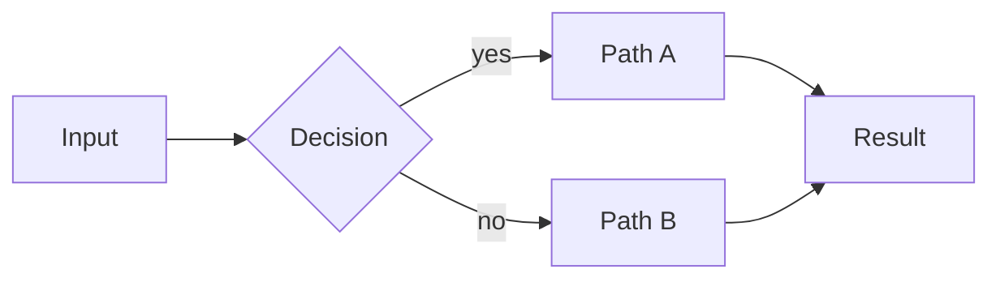
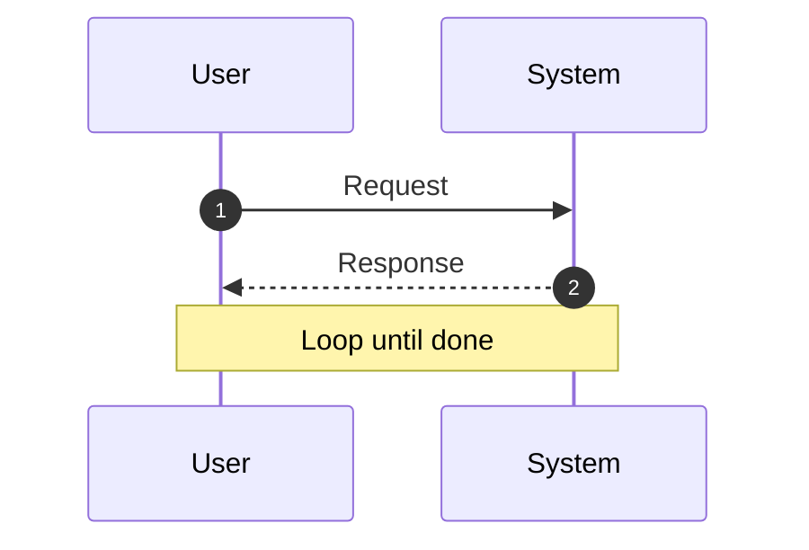
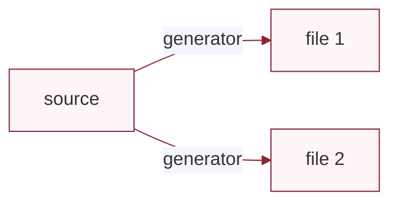
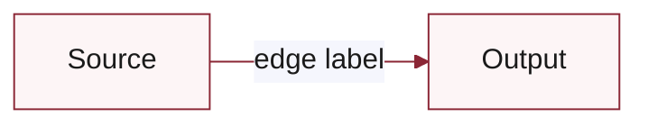
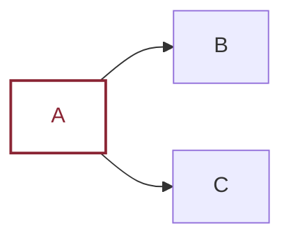

# Modern README Patterns — copyable snippets

All snippets target GitHub's Flavored Markdown renderer (the only one that matters for OSS READMEs). Many will not render correctly in PyCharm / VS Code preview; always verify on GitHub.

## Centered header with dot-nav

```markdown
<a id="readme-top"></a>

<div align="center">

# project-name

**One-line tagline that survives on its own.**

Short elevator pitch — one or two sentences.

[](https://pypi.org/project/project-name/)
[](LICENSE)
[](https://github.com/owner/project-name/actions/workflows/validate.yml)

[Install](#install) &nbsp;•&nbsp;
[Features](#features) &nbsp;•&nbsp;
[Docs](#docs)

</div>
```

Notes:
- `<a id="readme-top"></a>` gives a stable anchor for the "back to top" link.
- Keep the tagline under 15 words. If it is longer, it is a paragraph, not a tagline.
- Customize badge color via the `?color=` query (hex, no `#`). Match the project brand if you have one.

## Badges (Shield.io)

Common ones, in recommended order:

```markdown
[](https://pypi.org/project/<pkg>/)
[](https://www.npmjs.com/package/<pkg>)
[](LICENSE)
[](https://github.com/<owner>/<repo>/actions/workflows/<file>.yml)
[](https://github.com/<owner>/<repo>)
[](https://pypi.org/project/<pkg>/)
```

Do not exceed 5-6. More becomes visual noise.

## Hero image

### Single PNG (simplest)

```markdown

```

Generate from an HTML mockup via headless Chrome (see `ci-mockup-figure` skill). Always commit the source HTML alongside the PNG so regeneration is reproducible.

### Light/dark pair via `<picture>`

```markdown
<p align="center">
  <picture>
    <source media="(prefers-color-scheme: dark)"  srcset="docs/logo-dark.svg">
    <source media="(prefers-color-scheme: light)" srcset="docs/logo-light.svg">
    
  </picture>
</p>
```

Use when the project has a distinct logo/wordmark that reads differently on light and dark backgrounds. For most mid-size OSS projects, a single PNG is fine.

## GitHub alert callouts

Syntax: `> [!NOTE]` / `[!TIP]` / `[!WARNING]` / `[!CAUTION]` / `[!IMPORTANT]` as the **first line** of the blockquote, alone on that line.

```markdown
> [!NOTE]
> Maintained by [Name](https://link) — two-sentence credentials paragraph. Verifiable claims only: package stars, download counts, citation counts, institutional affiliation.

> [!TIP]
> The simplest install is to tell your AI agent: _"Install <pkg> in this project."_

> [!WARNING]
> Breaking change in v2.0: the default behavior of X changed to Y. Pin to v1.x if you need the old behavior.
```

Rules:
- Only one per major section. If every paragraph is a callout, none of them are.
- The first source line must be exactly `> [!NAME]` — one blockquote marker, one alert tag, alone on that line. No indentation, no extra blockquote prefix before the marker.
- Renders as a colored box with an icon on GitHub only. PyCharm / VS Code default previews show it as a plain blockquote.

## Emoji-prefixed feature bullets

```markdown
## What you get

- 🛡️ **Loud safety** — destructive commands hit a loud warning block. Read-only ops stay silent.
- 🔄 **Dual-agent review** — implementer + gatekeeper with independent judgment.
- ✍️ **Consistent writing style** — 40+ AI-tell words banned; format preserved.
- 🧭 **Auto dispatch** — router picks the right skill from prompt + file type.
- 🔒 **Git safety** — commit/push/reset always confirm; read-only ops stay fast.
```

Each bullet = one emoji + **bold feature name** + em-dash + one-line takeaway. Aim for 5–8 bullets. Fewer than 4 feels thin; more than 8 becomes a wall.

Do not use emoji on section headings (`## 🚀 Quickstart` reads as noise). Reserve emoji for the feature-bullet line.

## Tables instead of bullets

For reference content (comparisons, scenario → action, decision matrices), tables beat bullets:

```markdown
| Scenario | Do this |
|----------|---------|
| Add to a new project | Run `pipx run project-name` in project root |
| Get latest updates | Start a new session — bootstrap runs automatically |
| Force refresh | `bash .agent-config/bootstrap.sh` |
```

Compare to the bullet equivalent:

```markdown
- **Add to a new project:** Run `pipx run project-name` in the project root.
- **Get latest updates:** Start a new session — bootstrap runs automatically.
- **Force refresh:** Run `bash .agent-config/bootstrap.sh`.
```

The table version is denser, reads faster, and scales to 10+ rows without becoming a wall.

Use bullets when entries are prose-shaped (philosophy, principles). Use tables when entries are symmetric facts.

## Collapsible details

````markdown
<details>
<summary><b>Platform-specific install</b> (macOS / Linux / Windows)</summary>

macOS / Linux:

```bash
curl -sfL https://example.com/install.sh | bash
```

Windows (PowerShell):

```powershell
iwr https://example.com/install.ps1 | iex
```

</details>
````

When to collapse:
- Platform-specific variants of a command
- "Related projects" / "Alternatives"
- "Limitations and caveats"
- Repo layout / file tree
- "What this is not"
- FAQ
- Maintenance policy / contribution scope

When NOT to collapse:
- The primary install command
- The tagline or elevator pitch
- "What you get" bullets
- Required reading (license mention, prereqs)

## Mermaid diagrams

Flowchart (layout, architecture, decision tree):

~~~markdown

~~~

Sequence diagram (protocol, interaction, workflow):

~~~markdown

~~~

Renders natively on GitHub. Colors via `classDef` are stable; complex styling is fragile. Do not use for hero images — a rendered PNG has more visual weight.

## Back-to-top anchor

Place at the top:

```markdown
<a id="readme-top"></a>
```

And at the end of each major section (or just the bottom):

```markdown
<div align="center">

<a href="#readme-top">↑ back to top</a>

</div>
```

Worth it only for READMEs over ~150 lines. Shorter READMEs, skip it.

## Install paths (multi-ecosystem)

If the project has PyPI, npm, and raw-shell install options:

````markdown
## Install

> [!TIP]
> The simplest install is to tell your AI agent: _"Install <pkg> in this project."_

```bash
# Python (zero-install if you have pipx)
pipx run <pkg>

# Node.js (zero-install if you have Node 14+)
npx <pkg>
```

<details>
<summary><b>Raw shell (no package manager required)</b></summary>

macOS / Linux:

```bash
mkdir -p .dirname
curl -sfL https://example.com/install.sh -o .dirname/install.sh
bash .dirname/install.sh
```

Windows (PowerShell):

```powershell
New-Item -ItemType Directory -Force -Path .dirname | Out-Null
Invoke-WebRequest -UseBasicParsing -Uri https://example.com/install.ps1 -OutFile .dirname/install.ps1
& .\.dirname\install.ps1
```

</details>
````

Why this structure:
- Primary install commands are immediately visible (no scrolling, no expanding).
- Raw shell variants are collapsed because they are platform-specific (avoids making Windows users scroll past the macOS command or vice versa).
- The `> [!TIP]` callout tells agent-literate users the fastest path.

## Shell blocks inside markdown cells

Markdown tables do not support multi-line code blocks in cells. If you need to show a command inside a table row, keep it inline:

```markdown
| Scenario | Command |
|----------|---------|
| Python install | `pipx run <pkg>` |
| Node install | `npx <pkg>` |
```

For longer commands, link out of the table to a code block below, or use a different structure (bullets or collapsible).

## Avoiding common pitfalls

### Credentials in a blockquote, not a paragraph

```markdown
> [!NOTE]
> Maintained by [Name](https://link) — Role at Org, author of [Project](https://link) (X stars, Y downloads). Short pitch for why the reader should trust this setup.
```

Never a 100-word paragraph as the first thing after the tagline. That delays the install path.

### Alt text on hero images

```markdown

```

Screen readers, SEO, and the rendered fallback all benefit from descriptive alt text. "hero" alone is not descriptive.

### Anchor links match autogenerated slugs

GitHub autogenerates heading anchors:
- Lowercase everything
- Replace spaces with hyphens
- Strip most punctuation (parens, colons, question marks)
- Keep periods and underscores

Examples:
- `## What you get after setup (5 minutes)` → `#what-you-get-after-setup-5-minutes`
- `## Fork and customize (make it yours)` → `#fork-and-customize-make-it-yours`
- `## The agentic workflow this encodes` → `#the-agentic-workflow-this-encodes`

Always verify anchor links after a rewrite. Easiest way: push to a branch, view on GitHub, click each link.

## "What This Looks Like" examples block

Most READMEs show what the project IS (hero, features) but not what it LOOKS LIKE in practice. A 3-5 example block between **How it works** and **Install** gives a motivated reader concrete evidence:

- A real screenshot of the product running
- A file tree showing the artifact a user gets after install / bootstrap
- A diagram showing the system's core mechanic (themed Mermaid)
- A side-by-side before/after of the project's value claim (HTML 2-col table)
- A terminal mock showing a guard / safety message

**The hard rule: each example uses a different visual format.** Three monospace `text` code blocks in a row (tree + sample + terminal) read as a text wall, not as evidence. Variety pays off.

````markdown
## What This Looks Like

### Every Session Opens with a Status Banner


One-to-two-sentence caption naming what the reader sees and why it matters.

### What Appears in Your Repo After Bootstrap

```text
your-project/
├── AGENTS.md              # shared rules synced from upstream
├── ...
└── ...
```

One-sentence caption.

### One AGENTS.md, Rules for Every Agent



One-sentence caption.

### Writing That Does Not Read Like an AI

[2-col HTML table — see "HTML 2-col table for before/after" below]

### Safety Mock

```text
[guard.py] ⛔ STOP! HAMMER TIME!
...
```

One-sentence caption.
````

The 5 above are an example menu. Pick the 3-5 most credibility-building for the project. The discipline is variety-of-format, not number-of-examples.

## HTML 2-col table for before/after

Markdown tables cannot carry blockquotes, italic, `<mark>` tags, or multi-paragraph cells. When the comparison is rich, switch to an HTML `<table>`:

```html
<table>
<tr>
<th align="left">Without <code>project-name</code></th>
<th align="left">With <code>project-name</code></th>
</tr>
<tr>
<td valign="top">

> Blockquote with <mark>highlighted</mark> phrases inside.

<em>Italic commentary describing what is wrong.</em>

</td>
<td valign="top">

> Improved blockquote.

<em>Italic commentary describing what changed.</em>

</td>
</tr>
</table>
```

GitHub renders the HTML table side-by-side with a clean colored heading row. The blockquote `> ...` syntax inside `<td>` works because GitHub interprets markdown inside HTML tags **as long as the markdown content is separated from the HTML tags by blank lines** — critical, easy to miss.

Use sparingly: one before/after table per README is enough.

## Themed Mermaid (matches the project palette)

Default Mermaid colors (red error / orange warning / blue info) often clash with the project brand. Use a `%%{init: ...}%%` config block at the top of the diagram:

~~~markdown

~~~

Variables to set (all optional):
- `primaryColor` — fill of nodes; use a light tint of the brand color
- `primaryBorderColor` — node border; use the brand color
- `primaryTextColor` — text; high-contrast against `primaryColor`
- `lineColor` — edges and arrows; usually the brand color

`theme: 'base'` is the cleanest starting point. `theme: 'default'` reverts to GitHub's defaults; `theme: 'dark'` flips to dark mode. Test rendering on GitHub before merging — the live render is the only ground truth.

For one-off accent on a specific node, `classDef` works but is more limited:

~~~markdown

~~~

## Bold-lead scenario paragraphs (narrative Why)

When the "Why you'd use this" section has scenarios that are inherently narrative (cause / effect, before / after, day-in-the-life), bold-lead paragraphs read warmer than emoji-bullet lists:

```markdown
## Why You'd Use This

Four problems this fixes:

**You use more than one agent.** Claude Code at work, Codex on personal projects, Cursor on the side. Without `project-name`, three configs to keep in sync. With it, one config drives all three.

**You work across many repos.** Every new project repeats the same setup ritual: writing-style rules, permission policies, custom skills. Without `project-name`, you copy-paste between repos and watch them drift. With it, `bootstrap` pulls shared defaults and layers repo-local overrides on top.
```

Pattern: `**Bold lead sentence.** Setup. Without X, problem. With X, fix.`

Use bold-lead paragraphs when scenarios are stories. Use emoji-bullets (the earlier pattern) when scenarios are feature claims. The two patterns serve different content shapes.

## Version-boundary honesty

When a release ships primitives that are not yet wired into the main flow, mark the boundary explicitly. Do not write current behavior as if the v0.5 / v1.0 promise has already landed. Readers (and Codex reviewers) catch the overpromise immediately:

```markdown
**v0.4.0 boundary.** For pack selections that must affect `bootstrap` today, use the legacy `rule_packs:` key in `agent-config.yaml`. The `pack` CLI writes user-level `packs:` config now; `bootstrap` starts reading that user-level file and the project-level `packs:` key in v0.4.x.
```

Pattern: name the version, name what works today, name what is queued. Roadmap claims belong in a "What's Next" section that points at the changelog, not the install path.

The discipline carries through the README: every claim that mentions current behavior should match what shipped today, and every claim that mentions future behavior should be tagged with the target version (or routed to the changelog).

## Reproducible visual assets

When a README references a rendered asset (hero PNG from HTML, GIF from `vhs`, screenshot from a banner), commit the source AND a render helper alongside the asset:

```text
docs/
├── hero.html               # HTML source
├── hero.png                # Rendered output
├── banner.html             # HTML source
├── session-banner.png      # Rendered output
├── pack-cli-demo.tape      # vhs tape source
├── pack-cli-demo.gif       # Rendered output
├── _render_hero.py         # Playwright render helper (HTML -> PNG)
├── _render_banner.py       # Playwright render helper (HTML -> PNG)
├── _render_gif.sh          # Docker + vhs render helper (tape -> GIF)
└── _demo-helpers/          # Per-tool wrappers used by the renderers
```

For tools that render via Docker (vhs and similar), pin the image by content digest, not `:latest`:

```bash
VHS_IMAGE="ghcr.io/charmbracelet/vhs@sha256:9d5fc3dc0c160b0fb1d2212baff07e6bdf3fa9438c504a3237484567302fcf93"
```

Future maintainers can re-render from the same tool image instead of depending on whatever `:latest` happens to be when they pull. Without the digest pin, a hero PNG or GIF can drift from its source and no one notices until the next render rerun.

## Cross-surface parity (README + RTD landing + bilingual)

Projects that publish to multiple surfaces (README on GitHub, MkDocs landing on Read the Docs, optional zh-CN README) should share the same value-prop sections at the same depth:

| Surface | Tagline | Why | How It Works | Examples block | Pack CLI | What's Next |
|---|---|---|---|---|---|---|
| README.md | ✓ | ✓ paragraphs | ✓ | ✓ 5 examples | ✓ | ✓ |
| README.zh-CN.md | ✓ translated | ✓ translated | ✓ translated | ✓ English example body + translated commentary | ✓ | ✓ |
| docs/index.md (RTD landing) | ✓ | ✓ bullets, condensed | ✓ | — link to README | ✓ | ✓ |

Drift between surfaces is a real maintenance cost. For multi-surface projects, run a final cross-surface review pass that checks tagline, How It Works claims, and the roadmap paragraph match. The `implement-review` skill handles this via its "Cross-variant drift check" — name the surfaces as variant targets and the reviewer reports drift directly.

For bilingual READMEs:
- Keep technical terms in the original language (English `pack`, `composer`, `bootstrap`); do not invent Chinese equivalents.
- Translate concepts that have natural equivalents (`shared rules` → `共享规则`).
- Use informal pronouns (`你` not `您`) for warmth.
- Avoid translation-ese: forced `对...进行 X` / `在...的情况下` / `作为...的存在` patterns; long noun-modifier chains; `我们` where `你` or `我` fits.
- Keep example bodies in their natural source language. The English banned-word writing example stays English in zh-CN; only the Chinese commentary around it translates. Add a one-sentence note explaining why (the rule pack is currently English; multilingual rule packs are roadmap).

## Title Case for all H2 and H3 (RULE-G)

Apply Title Case across every H2 and H3, not just the page title:

- Capitalize the first word, the last word, and all major words (nouns, verbs, adjectives, adverbs, pronouns).
- Lowercase articles (`a`, `an`, `the`), coordinating conjunctions (`and`, `but`, `or`, `nor`), and short prepositions (`of`, `in`, `on`, `to`, `for`, `by`, `at`, `with`).
- Treat literal code (`AGENTS.md`, `git push`, `pack add`) as the literal token — keep its case.

Examples:
- `## How It Works` (not `## How it works`)
- `## What This Looks Like` (not `## What this looks like`)
- `## Pack Management CLI` (CLI is an acronym, all caps)
- `### Writing That Does Not Read Like an AI` (`That` capitalized; `an` lowercase; `AI` all caps)
- ``### `git push` Is Never a Silent Action`` (literal code preserved; `Is` capitalized)

A document with sentence-case headings inside a Title Case context (or vice versa) reads as machine-generated. Pick one and hold it. The full rule and rationale are in the [agent-style RULE-G](https://github.com/yzhao062/agent-style/blob/main/docs/rule-pack.md) directive.
